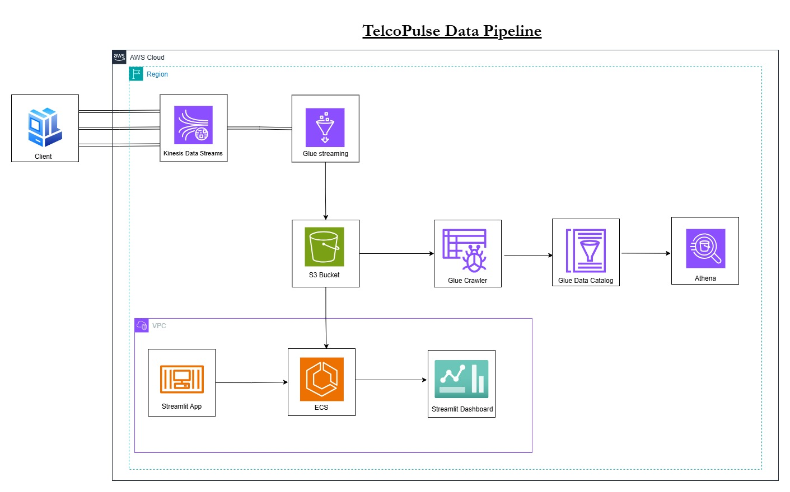
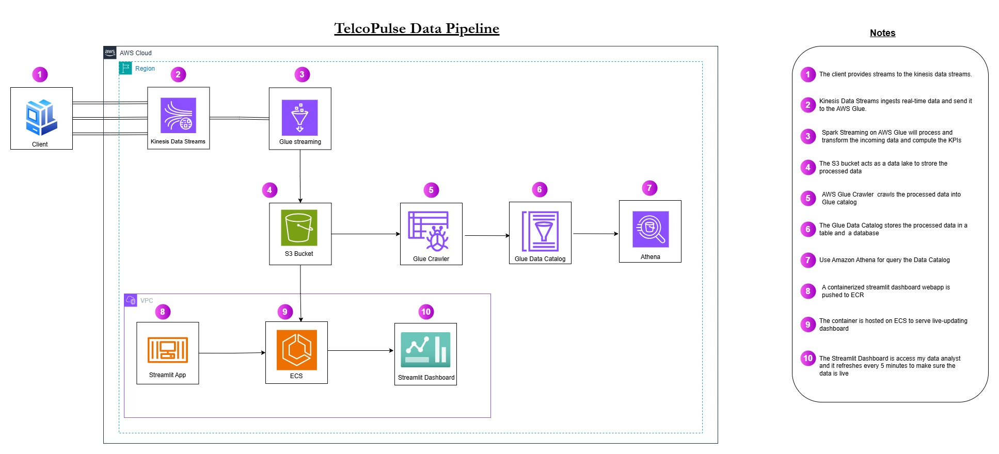

# TelcoPulse: Real-Time Network Metrics Dashboard
[](https://opensource.org/licenses/MIT)
[](https://aws.amazon.com/)
[](https://www.python.org/)

## 📌 Project Overview

**TelcoPulse** is a real-time analytics dashboard designed to monitor and visualize network performance metrics from multiple mobile network providers. This system ingests streaming data, processes it in near real time using AWS-native services, stores the results in a data lake, and visualizes key performance indicators (KPIs) via a Streamlit dashboard.

The project demonstrates end-to-end streaming data pipeline architecture using modern cloud tools and is ideal for showcasing skills in real-time data engineering and analytics.

---

## 🏗️ High Level Architecture Diagram

## Architecture

### Components
- **Data Ingestion**: Amazon Kinesis Data Streams
- **Processing**: AWS Glue Streaming ETL
- **Storage**: Amazon S3 Data Lake
- **Query Engine**: AWS Athena
- **Visualization**: Streamlit on ECS
- **Infrastructure**: Terraform 


---

## Features

- Real-time ingestion of network telemetry data
- Automated ETL pipeline using AWS Glue
- Serverless data lake architecture
- Interactive Streamlit dashboard
- Auto-scaling container deployment
- Near real-time KPI monitoring

## 🔧 Tools & Services Used

- **Amazon Kinesis Data Streams**: Ingest real-time network metric streams.
- **AWS Glue (Apache Spark Streaming)**: Process and transform incoming data.
- **Amazon S3**: Store transformed data as a data lake.
- **AWS Glue Crawlers**: Catalog data in S3 for queryability.
- **AWS Athena**: Query processed data using SQL.
- **Streamlit + Amazon ECS**: Host and serve a live-updating dashboard.

---
### Data Flow
1. Network metrics → Kinesis Stream
2. Kinesis → Glue ETL → S3
3. S3 → Glue Crawler → Athena
4. s3 → Streamlit Dashboard
---



## 📊 Key Performance Indicators (KPIs)

1. **Average Signal Strength per Operator**
2. **Average GPS Precision per Operator**
3. **Count of Network Statuses per Postal Code**

These metrics are updated every 5 minutes and displayed on a dynamic dashboard accessible to management for actionable insights.

---

## 🚀 Deployment Instructions

### 1. **Set Up Kinesis Data Stream**
- Create a Kinesis Data Stream named `network-metrics-stream`.
- Configure appropriate shard count based on expected throughput.

### 2. **Deploy AWS Glue Streaming Job**
- Upload the `glue_jobs/process_network_metrics.py` script to an S3 bucket.
- Create a new AWS Glue Streaming job:
  - Use the uploaded script.
  - Set the Kinesis stream as the source.
  - Output transformed data to your S3 data lake bucket in Parquet format.
  - Enable job monitoring and logging.

### 3. **Configure AWS Glue Crawler**
- Create a crawler pointing to your S3 output bucket.
- Schedule the crawler to run periodically (e.g., every 5 minutes).
- The crawler will update the table schema in the AWS Glue Data Catalog.

### 4. **Query with AWS Athena**
- Create an Athena workgroup and configure the result location in S3.
- Run queries against the Glue catalog table to validate data structure and quality.

Example Athena query:
```sql
SELECT operator, AVG(signal_strength) AS avg_signal
FROM network_metrics_table
GROUP BY operator;
```

### 5. **Build & Deploy Streamlit Dashboard on ECS**
- Build the Docker image from the `streamlit_dashboard/` folder:
  ```bash
  docker build -t telcopulse-dashboard .
  ```
- Push the image to Amazon ECR.
- Create an ECS task definition and service to run the container.
- Expose the Streamlit app via an Application Load Balancer.

### 6. **Access the Dashboard**
- Open the public endpoint provided by the ALB.
- View live-updated metrics refreshed every 5 minutes.

---

## 🧪 Sample Input Format

Each record sent to Kinesis should be a JSON object like:

```json
{
  "timestamp": "2025-04-05T12:34:56Z",
  "operator": "OperatorA",
  "signal_strength": -78,
  "gps_precision": 4.5,
  "network_status": "Connected",
  "postal_code": "94107"
}
```

---

## 📈 Dashboard Features

- Auto-refreshes every 5 minutes to show latest metrics.
- Displays grouped bar charts and tables for each KPI.
- Responsive UI for viewing across devices.

---

## ✅ Future Enhancements

- Add support for historical trend analysis using Amazon QuickSight.
- Implement anomaly detection on signal strength using AWS Machine Learning.
- Integrate alerting via Amazon SNS when thresholds are breached.
- Enable filtering by time range or region in the dashboard.

---


# S3 Parquet Dashboard

A Streamlit-based dashboard application that reads and visualizes Parquet files from an S3 bucket. The dashboard automatically refreshes every 5 minutes to show the latest data.

## Features

- 🔄 Auto-refreshing every 5 minutes
- 📊 Interactive data visualization
- 📈 Real-time data metrics
- 🔍 S3 bucket exploration
- 📋 Data preview and statistics
- 🎯 Customizable visualizations

## Prerequisites

- Python 3.11 or higher
- AWS credentials with S3 access
- Docker (optional, for containerized deployment)

## Installation

1. Clone the repository:
```bash
git clone <repository-url>
cd <repository-name>
```

2. Install dependencies:
```bash
pip install -r requirements.txt
```

3. Create a `.env` file in the project root with your AWS credentials:
```
AWS_ACCESS_KEY_ID=your_access_key_here
AWS_SECRET_ACCESS_KEY=your_secret_key_here
AWS_REGION=your_region_here
S3_BUCKET_NAME=your_bucket_name_here
```

## Running the Application

### Local Development

Run the Streamlit app:
```bash
streamlit run streamlit-app/app.py
```

### Docker Deployment

1. Build the Docker image:
```bash
docker build -t streamlit-s3-dashboard .
```

2. Run the container:
```bash
docker run -p 8501:8501 --env-file .env streamlit-s3-dashboard
```

The dashboard will be available at `http://localhost:8501`

## Usage

1. Enter your S3 bucket name in the sidebar
2. Optionally specify a prefix to filter Parquet files
3. The dashboard will automatically:
   - Load and combine all Parquet files
   - Display dataset overview
   - Show data preview
   - Provide interactive visualizations
   - Update every 5 minutes

## Dashboard Components

- **Dataset Overview**: Shows total rows, columns, and memory usage
- **Data Preview**: Displays the first few rows of the dataset
- **Data Visualization**: Interactive scatter plot with customizable axes
- **Column Statistics**: Statistical summary of all columns

## Auto-Refresh Feature

The dashboard automatically refreshes every 5 minutes to ensure you're always viewing the latest data. This is indicated by a refresh status in the sidebar.


## Contributing

1. Fork the repository
2. Create your feature branch
3. Commit your changes
4. Push to the branch
5. Create a new Pull Request


## 📝 License

This project is licensed under the MIT License – see the [LICENSE](LICENSE) file for details.

---

## 📬 Contact

For questions or contributions, feel free to reach out to the maintainer at [ghheskey@gmail.com] or open an issue on GitHub.

---

Enjoy building and deploying your real-time network analytics pipeline! 🚀📡